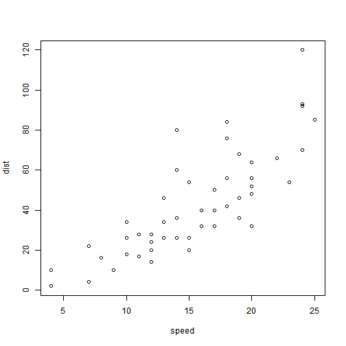

Notes on the course
========================================================
author: Gustavo Pantiga Melo
date: 08/13/2018
autosize: true

Why Flex Dashboard
========================================================

Some advantages of of Flex Dashboard over Shiny alone.

- They can work with or without Shiny (not dependent on R Server to run)
- Flexible Output with R Markdown (more consise and flexible - you can output it as HTML, Word document, deck of slides and so on)
- Easier to learn (Shiny requires you to understand the distinctions between server and UI code)

In the end. a flex dashboard is basically a R Markdown file rendered as a dashboard.

Layout of the Flex Dashboard
========================================================

There are many features to customize our dashboard.

These are the most basic (thinking about a R Markdown file):

# Page (#)
## Section (##)
### Content (###)

Slide With Plot
========================================================

